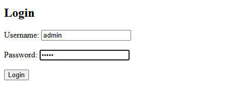

# PHP Session-Based Login System

This is a simple PHP-based login and logout system using sessions. It includes:

- `login.php` – User login form and session creation
- `dashboard.php` – A protected page only accessible after login
- `logout.php` – Ends the session and logs the user out
- `auth.php` – Shared session-checking file for protecting pages

---

## 📸 Screenshots

### 🔐 Login Page



### ✅ Dashboard (Protected Page)


---

## 🧪 Default Credentials

| Username | Password |
| -------- | -------- |
| `admin`  | `12345`  |

## You can change these in `login.php`.

## 🔧 How It Works

### ✅ `login.php`

- Displays a login form.
- Accepts hardcoded credentials (`admin` / `12345`).
- On successful login, sets `$_SESSION['username']` and redirects to `dashboard.php`.

### ✅ `dashboard.php`

- A protected page that includes `auth.php` to check if the user is logged in.
- Displays a welcome message and logout link.

### ✅ `logout.php`

- Destroys the current session.
- Redirects the user back to the login page.

### ✅ `auth.php`

- Starts a session.
- Checks if the user is logged in.
- Redirects to `login.php` if no valid session is found.

---

## 🚀 How to Run

1. Place all files in your local server directory (e.g., `htdocs` for XAMPP).
2. Start Apache server via XAMPP or run a PHP server.
3. Visit: `http://localhost/session-based-authentication/login.php`
4. Log in using the credentials above.
5. Try accessing `dashboard.php` directly – it will redirect if you're not logged in.

---

## 📁 File Structure

```
session-based-authenticaiton/
├── login.php
├── dashboard.php
├── logout.php
└── auth.php
```

---
