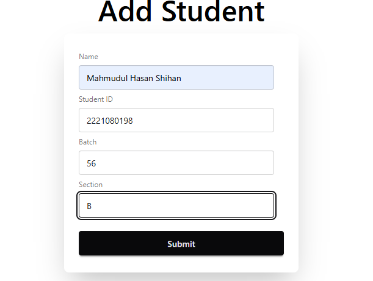
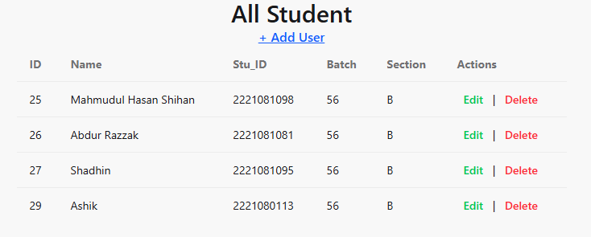
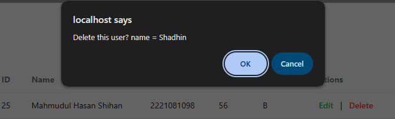

# Database CRUD Operation Using PHP

## 🧑‍💻 Submitted By:

**Name:** Mahmudul Hasan Shihan  
**ID:** 2221081098  
**Batch:** 56(B)  
**Department:** Computer Science and Engineering, Uttara University

## 📚 Submitted To:

**Md. Harun-Ar-Rashid**  
**Lecturer, CSE Dept.**  
**Course:** Internet Programming Sessional (CSEC 422)  
**Lab Report Number:** Final Report  
**Date of Submission:** May 4, 2025

---

## 📌 1. Introduction

In this lab, I developed a simple CRUD (Create, Read, Update, Delete) web application using **PHP** as the backend language and **MySQL** as the database. The front-end interface was styled using **Tailwind CSS** along with **DaisyUI**, a component library built on top of Tailwind.

This project demonstrates how a user can interact with a database through a user-friendly UI to **add**, **view**, **edit**, and **delete** data records.

### Objectives:

- Understand how PHP interacts with MySQL for database operations.
- Implement CRUD functionalities in a web application.
- Use utility-first CSS (Tailwind) with component libraries (DaisyUI) to design responsive UIs.

---

## 🛠 2. Technologies Used

- **Front-end:** HTML, Tailwind CSS, DaisyUI
- **Back-end:** PHP
- **Database:** MySQL
- **Tools:** VS Code, XAMPP, GitHub

---

## 🚀 3. Features Implemented

- ✅ Create new records (e.g., student info)
- ✅ Display records in a styled table
- ✅ Edit/update existing records
- ✅ Delete records with confirmation
- ✅ Responsive UI using Tailwind CSS and DaisyUI

---

## 🖼 4. Step-by-Step Screenshots

### 📄 Step 1: Landing Page - Click “Add User” to add a new student


---

### ➕ Step 2: Create Operation (Add New Record)

- Fill the form and click `Submit` to add a new user.  
  

After submission, the new student record is displayed in the table.  


---

### ✏️ Step 3: Update Operation (Edit Record)

- Click the `Update` button to navigate to the update page.
- Modify the required information and click `Update`.

A success message appears after successful update.  


---

### ❌ Step 4: Delete Operation (Delete Record)

- Click the `Delete` button.
- A confirmation popup appears.
- Confirm to delete the record.  
  

---

## 🗃 5. Database Structure

```sql
CREATE TABLE IF NOT EXISTS student_info (
    id INT AUTO_INCREMENT PRIMARY KEY,
    name VARCHAR(100) NOT NULL,
    stu_id VARCHAR(20) NOT NULL,
    batch VARCHAR(20),
    section VARCHAR(20)
);
```

## Conclusion

This lab helped reinforce core web development concepts including PHP scripting, database interaction, and responsive UI design. I was able to:

- Understand how server-side languages interact with databases.
- Implement essential CRUD functionalities.
- Use Tailwind CSS and DaisyUI to build an intuitive and clean UI.

Overall, this project improved both my front-end and back-end development skills and provided practical experience in building a full-stack web application.
